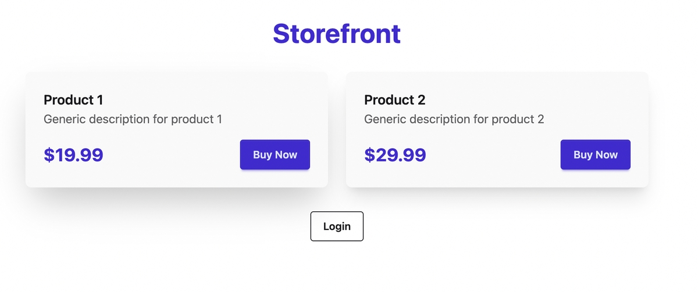
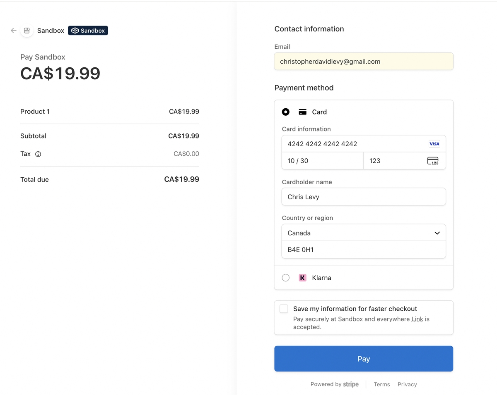
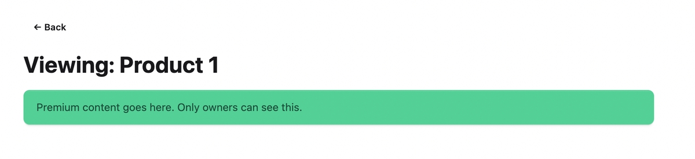
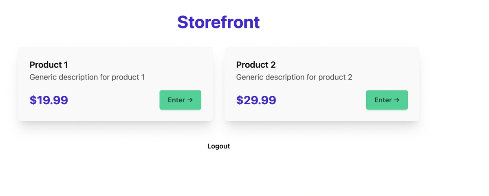
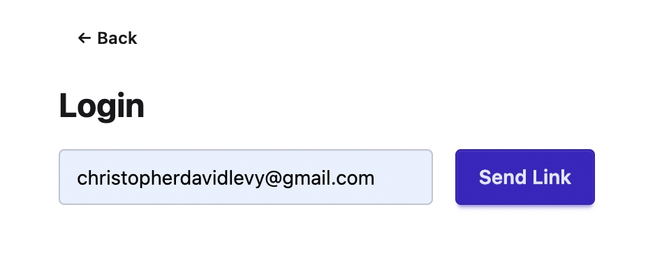
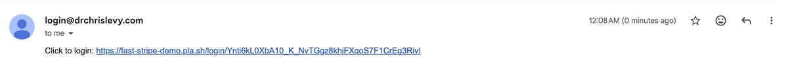

# FastHTML + Stripe Integration Tutorial

A guide to understanding this passwordless e-commerce application built with FastHTML, FastLite, and Stripe.

## Architecture Overview

```
┌─────────────────────────────────────────────────────────────────┐
│                        User Browser                             │
└─────────────────────────────────────────────────────────────────┘
                              │
                              ▼
┌─────────────────────────────────────────────────────────────────┐
│                     FastHTML Application                        │
│  ┌─────────────┐  ┌─────────────┐  ┌─────────────────────────┐  │
│  │ Beforeware  │  │   Routes    │  │    Stripe Integration   │  │
│  │ (Auth Gate) │  │ (Handlers)  │  │  (Payments & Webhooks)  │  │
│  └─────────────┘  └─────────────┘  └─────────────────────────┘  │
└─────────────────────────────────────────────────────────────────┘
                              │
              ┌───────────────┴───────────────┐
              ▼                               ▼
┌─────────────────────────┐     ┌─────────────────────────┐
│    SQLite Database      │     │     Stripe API          │
│  (users, links, buys)   │     │  (Checkout, Webhooks)   │
└─────────────────────────┘     └─────────────────────────┘
```

**Key Concepts:**
- **Passwordless Auth**: Users log in via magic links (emailed tokens), no passwords stored
- **Session-Based State**: User identity stored in encrypted session cookies
- **Idempotent Purchases**: Purchases are recorded safely even if webhooks/redirects race

## Dependencies

| Library | Purpose |
|---------|---------|
| `fasthtml` | Web framework |
| `fastlite` | SQLite database with dict-like access |
| `faststripe` | Wrapper around Stripe for common operations |
| `stripe` | Official Stripe Python SDK |
| `resend` | Email delivery for magic links |
| `secrets` | Cryptographically secure token generation |

## Database Schema

```python
db = database(DB_NAME)
users, links, buys = db.t.users, db.t.magic_links, db.t.purchases
```

```
┌──────────────┐     ┌──────────────────┐     ┌──────────────────┐
│    users     │     │   magic_links    │     │    purchases     │
├──────────────┤     ├──────────────────┤     ├──────────────────┤
│ id (PK)      │◄────│ email            │     │ id (PK)          │
│ email (UQ)   │     │ token            │     │ user_id (FK)     │──►users.id
└──────────────┘     │ expires          │     │ prod_id          │
                     │ used             │     │ sess_id (UQ)     │
                     └──────────────────┘     │ amt              │
                                              └──────────────────┘
```

- **users**: Created only when someone purchases (no separate sign-up)
- **magic_links**: Tokens for passwordless login, expire after 24 hours, single-use
- **purchases**: Links users to products, `sess_id` is Stripe's checkout session ID

## Authentication System

### Beforeware (Middleware)

```python
def before(req, sess):
    req.scope["user_id"] = sess.get("user_id")

beforeware = Beforeware(before, skip=[
    r"/favicon\.ico", r"/static/.*", r".*\.css", r".*\.js",
    "/webhook",        # Webhooks can't have sessions
    "/login/.*",       # Login links must work without auth
    "/request-login"   # Login form must be accessible
])
```

This runs before every request, reading `user_id` from the encrypted session cookie and attaching it to `req.scope` for route handlers.

### App Initialization

```python
app, rt = fast_app(
    before=beforeware,
    secret_key=os.getenv("FAST_APP_SECRET"),  # Encrypts session cookie
    max_age=365*24*3600,                       # Cookie lasts 1 year
    ...
)
```

The `secret_key` cryptographically signs the cookie so users can't tamper with it.

---

## Stripe Integration

### The Two Stripe Clients

```python
sapi = StripeApi(os.getenv("STRIPE_SECRET_KEY"))  # FastStripe - for creating checkouts
stripe.api_key = os.getenv("STRIPE_SECRET_KEY")   # Official SDK - for webhooks & session retrieval
```

We use FastStripe's `one_time_payment()` for simple checkout creation, but the official SDK for webhook signature verification and retrieving session details.

### Creating a Checkout Session (`/buy/{pid}`)

```python
@rt("/buy/{pid}")
def buy(pid: str, req):
    p = PRODUCTS[pid]
    chk = sapi.one_time_payment(
        p["name"],
        p["price"],
        f"{BASE_URL}/view/{pid}?session_id={{CHECKOUT_SESSION_ID}}",  # Success URL
        f"{BASE_URL}/",  # Cancel URL
        currency="cad",
        metadata={"pid": pid},  # Retrieved later in webhook
    )
    return RedirectResponse(chk.url)
```

**Key details:**
- `metadata={"pid": pid}` - Stores the product ID so we can retrieve it in the webhook and verify it on redirect.
- Prices are in **cents** (1999 = $19.99) - Stripe's convention to avoid floating-point issues.

**The `{CHECKOUT_SESSION_ID}` template variable:**

```
STEP 1 - Your code:
f"{BASE_URL}/view/{pid}?session_id={{CHECKOUT_SESSION_ID}}"
                                   ↑↑                    ↑↑
                          Double braces = literal braces in f-string

STEP 2 - What Stripe receives:
"http://localhost:5001/view/p1?session_id={CHECKOUT_SESSION_ID}"
                                          ↑ literal placeholder ↑

STEP 3 - What Stripe sends to browser after payment:
"http://localhost:5001/view/p1?session_id=cs_test_a1b2c3..."
                                          ↑ actual session ID ↑
```

Stripe's server replaces the placeholder when redirecting - you never populate this value yourself.

---

## The Race Condition

After successful payment, **two things happen simultaneously**:

```
                    ┌─────────────────────────────────┐
                    │      User completes payment     │
                    └─────────────────────────────────┘
                                    │
                    ┌───────────────┴───────────────┐
                    ▼                               ▼
         Browser redirect                    Webhook POST
         to /view/{pid}?session_id=...       to /webhook
         (usually arrives FIRST)             (arrives async)
```

The redirect typically arrives **before** the webhook. Both paths need to handle creating users and recording purchases, because either one might arrive first.

### Path A: The Redirect (`/view/{pid}`)

```python
@rt("/view/{pid}")
def view(pid: str, req, sess, session_id: str = None):
    uid = req.scope.get("user_id")

    # Auto-login if returning from Stripe (not logged in, but has session_id)
    if not uid and session_id:
        s = stripe.checkout.Session.retrieve(session_id)

        if s.payment_status == "paid" and s.metadata.get("pid") == pid:
            email = s.customer_details.email

            # Get or create user
            u = next(users.rows_where("email = ?", [email]), None) \
                or users.insert(email=email)

            # Record purchase IF not already recorded (idempotent)
            if not next(buys.rows_where("sess_id = ?", [s.id]), None):
                buys.insert(user_id=u["id"], prod_id=pid, sess_id=s.id, amt=s.amount_total)

            # Log the user in immediately
            sess["user_id"] = u["id"]
            uid = u["id"]
```

**What this does:**
1. Retrieves the checkout session directly from Stripe API
2. Verifies payment succeeded (`payment_status == "paid"`)
3. Verifies the product matches (`metadata.pid == pid`) - security check
4. Creates user if they don't exist
5. Records purchase **only if `sess_id` doesn't exist** (idempotent)
6. Sets the session cookie → user is logged in immediately

### Path B: The Webhook (`/webhook`)

```python
@rt("/webhook", methods=["POST"])
async def stripe_webhook(req):
    # Verify the request is from Stripe (cryptographic signature check)
    ev = stripe.Webhook.construct_event(
        await req.body(),
        req.headers.get("stripe-signature"),
        os.getenv("STRIPE_WEBHOOK_SECRET")
    )

    if ev.type == "checkout.session.completed":
        s = ev.data.object

        # Record purchase IF not already recorded (idempotent)
        if not next(buys.rows_where("sess_id = ?", [s.id]), None):
            u = next(users.rows_where("email = ?", [s.customer_details.email]), None) \
                or users.insert(email=s.customer_details.email)
            buys.insert(user_id=u["id"], prod_id=s.metadata.pid, sess_id=s.id, amt=s.amount_total)

            # Send magic link for future logins
            token = secrets.token_urlsafe(32)
            links.insert(email=s.customer_details.email, token=token,
                        expires=(datetime.now() + timedelta(days=1)).isoformat(), used=False)
            send_login_email(s.customer_details.email, token)

    return Response(status_code=200)
```

**What this does:**
1. Verifies webhook signature (prevents fake payment notifications)
2. Creates user if they don't exist
3. Records purchase **only if `sess_id` doesn't exist** (idempotent)
4. Generates and emails a magic link for future logins

### The Idempotency Check

Both paths use the same pattern before inserting a purchase:

```python
if not next(buys.rows_where("sess_id = ?", [s.id]), None):
    buys.insert(...)
```

This ensures the purchase is only recorded once, regardless of:
- Which path runs first (redirect vs webhook)
- If Stripe sends the webhook multiple times (they retry on failure)

The `sess_id` (Stripe's checkout session ID) is the unique key that makes this safe.

### Why Both Paths?

| Path | Purpose | Creates user? | Records purchase? | Logs in? | Sends email? |
|------|---------|---------------|-------------------|----------|--------------|
| Redirect | Immediate UX | Yes | Yes | **Yes** | No |
| Webhook | Reliable record | Yes | Yes | No | **Yes** |

- **Redirect gives immediate access** - User doesn't wait or check email
- **Webhook ensures reliability** - If user closes browser, purchase is still recorded
- **Email provides future access** - User can log back in later via magic link

---

## The Complete Purchase Flow

```
     User                    Your App                    Stripe
       │                        │                          │
       │  1. Click "Buy Now"    │                          │
       │───────────────────────►│                          │
       │                        │                          │
       │                        │  2. Create Checkout      │
       │                        │  Session (with metadata) │
       │                        │─────────────────────────►│
       │                        │                          │
       │                        │  3. Return session URL   │
       │                        │◄─────────────────────────│
       │                        │                          │
       │  4. Redirect to Stripe │                          │
       │◄───────────────────────│                          │
       │                        │                          │
       │  5. Complete Payment   │                          │
       │──────────────────────────────────────────────────►│
       │                        │                          │
       │                        │  6. Webhook: payment     │
       │                        │     complete             │
       │                        │◄─────────────────────────│
       │                        │                          │
       │                        │  7. Record purchase,     │
       │                        │     send magic link      │
       │                        │                          │
       │  8. Redirect to        │                          │
       │     success URL        │                          │
       │◄──────────────────────────────────────────────────│
       │                        │                          │
       │  9. Auto-login &       │                          │
       │     show content       │                          │
       │◄───────────────────────│                          │
```

---

## User Lifecycle

### Visual Walkthrough

**1. Guest views storefront** → **2. Stripe Checkout**

|  |  |
|:------------------------------:|:----------------------------:|

**3. Premium content unlocked** → **4. Storefront shows owned products**

|  |  |
|:---------------------------:|:------------------------------:|

**5. Login page** → **6. Magic link email received**

|  |  |
|:-------------------------:|:-------------------------:|

### Detailed Flow

```
Guest visits site (no user record, no session)
        │
        ▼
Clicks "Buy Now" → Redirected to Stripe Checkout
        │
        ▼
Completes payment (enters email on Stripe's form)
        │
        ├───────────────────────────────────┐
        │                                   │
        ▼                                   ▼
   /view/{pid} redirect              /webhook POST
   (usually runs first)              (runs async)
        │                                   │
        ▼                                   ▼
   ┌─────────────────┐              ┌─────────────────┐
   │ User exists?    │              │ User exists?    │
   │   NO → Create   │              │   NO → Create   │
   │   YES → Fetch   │              │   YES → Fetch   │
   └─────────────────┘              └─────────────────┘
        │                                   │
        ▼                                   ▼
   sess['user_id'] = id             Generate & email
   (LOGGED IN NOW)                  magic link
        │
        ▼
   User sees purchased content
        │
        ▼
   ... time passes, session expires or user logs out ...
        │
        ▼
   User clicks magic link (or requests new one at /request-login)
        │
        ▼
   /login/{token} → sess['user_id'] = id
   (LOGGED IN AGAIN)
```

**Why can't users "sign up" without buying?**

The `/request-login` route only creates magic links for existing users:

```python
if email and next(users.rows_where("email = ?", [email]), None):
    # Only sends link if user exists
```

This is intentional - it's a **purchase-gated** system.

---

## Magic Link Authentication

### Request a new link (`/request-login`)

```python
@rt("/request-login", methods=["GET", "POST"])
def request_login(email: str = None):
    if email and next(users.rows_where("email = ?", [email]), None):
        tok = secrets.token_urlsafe(32)  # 32 bytes = 43 characters
        links.insert(email=email, token=tok,
                    expires=(datetime.now() + timedelta(days=1)).isoformat(), used=False)
        send_login_email(email, tok)
```

### Use the link (`/login/{token}`)

```python
@rt("/login/{token}")
def magic_login(token: str, sess):
    link = next(links.rows_where("token = ? AND used = 0", [token]), None)

    if not link or datetime.now() > datetime.fromisoformat(link["expires"]):
        return "Link Expired"

    links.update({"id": link["id"], "used": True})  # Mark as used
    u = next(users.rows_where("email = ?", [link["email"]]))
    sess["user_id"] = u["id"]
    return RedirectResponse("/")
```

**Security features:**
- Token is 32 bytes of cryptographically random data
- Expires after 24 hours
- Single use (marked `used=True` after login)

---

## Security Considerations

**What's done well:**
- **Webhook signature verification** - `stripe.Webhook.construct_event()` prevents fake payment notifications
- **Idempotent purchase recording** - `sess_id` check prevents duplicates
- **Magic link expiration** - Links expire after 24 hours
- **Single-use tokens** - Links can't be reused after login
- **Session encryption** - `secret_key` encrypts cookies so users can't tamper
- **Payment verification** - Redirect checks `payment_status == "paid"` and `metadata.pid`

**Things to consider for production:**
- Use HTTPS (Stripe requires it)
- Add rate limiting to `/request-login` to prevent abuse
- Consider proper logging instead of `print()` statements

---

## Quick Reference

### Environment Variables

```env
STRIPE_SECRET_KEY=sk_test_...       # Stripe secret key
STRIPE_WEBHOOK_SECRET=whsec_...     # Webhook signing secret
FAST_APP_SECRET=<random-string>     # Session encryption key
RESEND_API_KEY=re_...               # Resend API key for emails
EMAIL_FROM=login@yourdomain.com     # Verified sender address
BASE_URL=https://yourdomain.com     # Your app's public URL (optional locally)
```

### Stripe Test Cards

| Card Number | Result |
|-------------|--------|
| 4242 4242 4242 4242 | Success |
| 4000 0000 0000 0002 | Declined |
| 4000 0000 0000 3220 | 3D Secure required |

Use any future expiry date and any 3-digit CVC.

### Testing Webhooks Locally

```bash
stripe listen --forward-to localhost:5001/webhook
# Use the whsec_... it outputs as STRIPE_WEBHOOK_SECRET
```

---

## Summary

This application demonstrates a clean pattern for selling digital products:

1. **No passwords** - Users authenticate via magic links
2. **Stripe handles payments** - You never touch card numbers
3. **Idempotent operations** - Safe against duplicate webhooks/requests
4. **Immediate access** - Auto-login after purchase, no waiting for webhooks

The key insight is that both the redirect AND the webhook can create users and record purchases, but the `sess_id` check ensures it only happens once. This makes the system resilient to timing issues while providing a smooth user experience.
